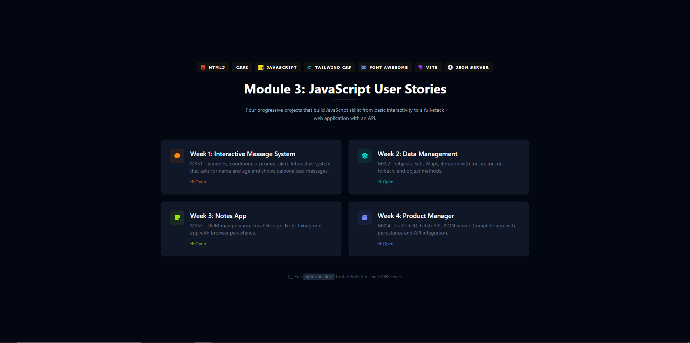

# Module 3 - JavaScript User Stories

<p align="center">
  
  
  
  
  
  
  
  
</p>

<p align="center">
  
</p>

This repository contains four weekly projects that progressively build JavaScript skills, from basic interactivity to a full-stack web application with API integration.

## Structure

```
UserStoriesModule_3/
  index.html           - Landing page with navigation to all weeks
  package.json         - Dependencies: Vite, Tailwind, JSON Server
  vite.config.js       - Dev server with proxy and Tailwind plugin
  db.json              - Data file for JSON Server (Week 4)
  shared/
    tailwind.css       - Tailwind CSS entry point
    textTarea.js       - Reusable console-output capture component
    textTarea.css      - Animations and scrollbar styling
  Week_One/            - Interactive Message System (M3S1)
  Week_Two/            - Data Management (M3S2)
  Week_three/          - DOM Manipulation & Local Storage (M3S3)
  Week_Four/           - Full Stack App with Fetch API (M3S4)
```

## Quick Start

```bash
# Clone the repository
git clone https://github.com/Zerik-Official/User_Stories_JavaScript

# change into repository folder
cd User_Stories_JavaScript

# Install dependencies
npm install

# Start both Vite dev server and JSON Server with one command
npm run dev
```

Then open `http://localhost:5173` in your browser.

## Shared Component

**TextTarea** is a reusable class that overrides `console.log`, `console.warn`, `console.error`, `window.prompt`, and `window.alert` to display all program output in a styled DOM panel. It uses:

- Tailwind CSS for layout and styling
- Font Awesome for icons
- Custom CSS animations for entry appearance

## Weeks Overview

| Week | Topic | File |
|------|-------|------|
| 1 | Interactive Message System | `sistema_interactivo.js` |
| 2 | Data Management (Objects, Sets, Maps) | `gestion_datos.js` |
| 3 | DOM Manipulation & Local Storage | `manipulacion_dom.js` |
| 4 | Full Stack App with Fetch API | `app.js` |

## How to Use

Each week is accessed through the landing page at `http://localhost:5173`:

1. **Week 1** - Click Start, enter name and age via modal prompts, see personalized output.
2. **Week 2** - Click Run to execute all data structure operations and view results.
3. **Week 3** - Type notes and add/remove them; data persists across reloads.
4. **Week 4** - Add/edit/delete products; click Sync to POST all items to the local JSON Server.

## Technologies

- Vanilla JavaScript (ES6+)
- Vite (dev server and build tool)
- Tailwind CSS (PostCSS plugin)
- Font Awesome 6 (via CDN)
- JSON Server (local REST API for testing)
- Local Storage (browser persistence)


> [!IMPORTANT]
Dev by [Zerik](https://github.com/Zerik-Official)